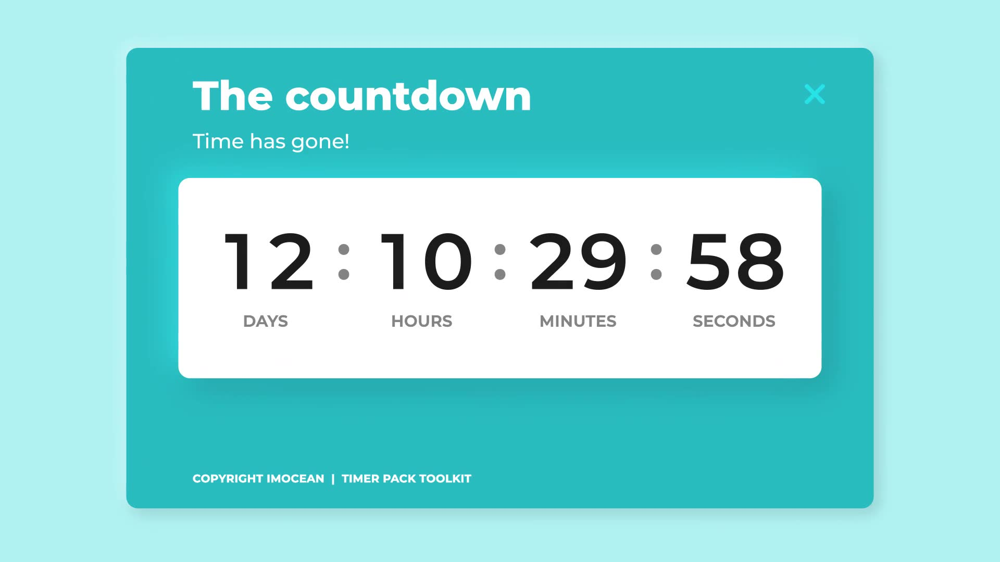

# Interactive Countdown Timer



An interactive countdown timer web application that allows users to select any future date and time and see a live countdown in days, hours, minutes, and seconds.

---

## Features

- 🗓️ User input: Pick any future date and time using a simple interface.
- ⏱️ Real-time countdown: Live update of remaining time every second.
- 🚨 Validation: Prevents starting the timer for past dates.
- 🎉 Event alert: Shows a message when countdown reaches zero.
- 📱 Responsive design: Works on desktops, tablets, and phones.

---

## Technologies Used

- HTML5
- CSS3
- JavaScript (Vanilla)

---

## How to Use

1. Clone this repository:

   ```bash
   git clone https://github.com/dinesh-2601/CodeClause_CountdownTimer
   ```

2. Open `index.html` in your favorite browser.

3. Select a future date/time and click **Start Countdown**.

---

## Live Demo

[Try the live demo here](https://dinesh-2601.github.io/CodeClause_CountdownTimer/)

---

## License

This project is open source and available under the MIT License.
